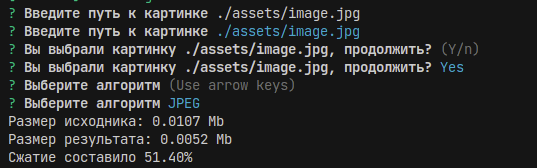

# Compression Algorithms Showcase

## Что нужно сделать

Разработать программный продукт для реализации методов сжатия графической информации.

-   Предоставить пользователю возможность выбора файла
-   Реализовать два алгоритма (RLE)[https://en.wikipedia.org/wiki/Run-length_encoding], LZW.
-   Реализовать алгоритм сжатия Хаффмана или алгоритм сжатия данных с потерями.
-   Выполнить сравнение эффективности степени сжатия с исходным файлом и алгоритмов друг с другом (исходный размер/размер сжатых данных).

## Реализованные алгоритмы
Run-length encoding, Lempel–Ziv–Welch (LZW), JPEG encoding